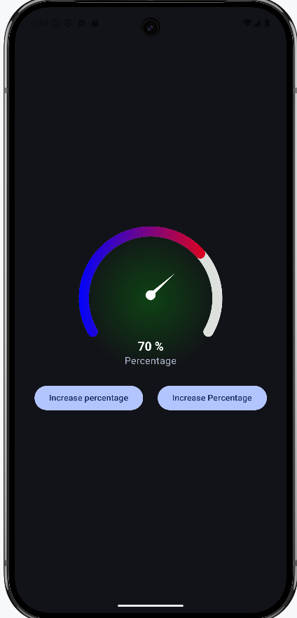

# Percentage Gauge - Jetpack Compose

A highly customizable percentage gauge component built with Jetpack Compose, perfect for visualizing progress or any value within a 0-100% range.

## Table of Contents

-   [Features](#features)
-   [Screenshots](#screenshots)
-   [Getting Started](#getting-started)
    -   [Prerequisites](#prerequisites)
    -   [Installation](#installation)
-   [Usage](#usage)
-   [Customization](#customization)
-   [Code Structure](#code-structure)
-   [Dependencies](#dependencies)
-   [Contributing](#contributing)
-   [License](#license)
-   [Contact](#contact)
- [Project Link](#project-link)

## Features

-   **Visually Appealing Gauge:** Displays a percentage value using a circular arc gauge with a smooth, modern design.
-   **Customizable Colors:**
    -   `trackColor`: Change the color of the gauge's background track.
    -   `progressColors`: Use a gradient or a list of colors for the progress arc.
    -   `innerGradient`: Customize the color of the inner radial gradient.
    - `percentageTextColor`: Customize the color of the percentage text.
-   **Adjustable Size:** Control the overall size of the gauge using the `gaugeSize` parameter.
-   **Adjustable Track Width:** Control the thickness of the gauge's track using the `trackWidth` parameter.
-   **Customizable Needle:**
    -   `needleLength`: Adjust the length of the needle.
    -   `needleBaseWidth`: Adjust the width of the needle's base.
-   **Customizable Arc:**
    - `sweepAngle`: Change the angle of the arc.
    - `startAngle`: Change the start angle of the arc.
- **Customizable Percentage Text**: Change the text below the percentage.
-   **Smooth Needle Animation:** The needle moves smoothly to indicate the current percentage.
-   **Input Validation:** Handles invalid percentage inputs gracefully by clamping them between 0 and 100.
-   **Jetpack Compose UI:** Built entirely with Jetpack Compose, the modern UI toolkit for Android.

## Screenshots

## Getting Started

### Prerequisites

-   Android Studio (latest version recommended)
-   Android SDK (API level 21 or higher)
-   Basic knowledge of Kotlin and Jetpack Compose

### Installation

1.  **Clone the repository:**
2.  **Open in Android Studio:**

    -   Open Android Studio and select "Open an existing Android Studio project."
    -   Navigate to the cloned repository directory and select it.

3.  **Build and Run:**

    -   Connect an Android device or start an emulator.
    -   Click the "Run" button in Android Studio.

## Usage

1.  Add the `PercentageGauge` composable to your project.
2.  Pass the desired `percentage` value to the composable.
3.  Customize the appearance using the available parameters.

    kotlin 
   import androidx.compose.foundation.layout.Column 
   import androidx.compose.foundation.layout.fillMaxSize 
   import androidx.compose.runtime.Composable 
   import androidx.compose.runtime.getValue 
   import androidx.compose.runtime.mutableIntStateOf 
   import androidx.compose.runtime.remember 
   import androidx.compose.runtime.setValue 
   import androidx.compose.ui.Alignment 
   import androidx.compose.ui.Modifier 
   import androidx.compose.ui.graphics.Color 
   import com.yourpackage.PercentageGauge

   @Composable 
   fun MyScreen() { 
       var currentPercentage by remember { mutableIntStateOf(50)  }
       Column(
          modifier = Modifier.fillMaxSize(),
          horizontalAlignment = Alignment.CenterHorizontally
       ) {
          PercentageGauge(
             percentage = currentPercentage,
             progressColors = listOf(Color.Blue, Color.Red),
             innerGradient = Color.Green
          )
       }
   }

## Customization

The `PercentageGauge` composable offers a wide range of customization options:

-   **`percentage: Int`:** The percentage value to display (0-100).
-   **`trackColor: Color`:** The color of the gauge's background track.
-   **`progressColors: List<Color>`:** A list of colors to use for the progress arc's gradient.
-   **`innerGradient: Color`:** The color of the inner radial gradient.
- **`percentageTextColor: Color`**: The color of the percentage text.
-   **`gaugeSize: Dp`:** The overall size of the gauge (default: 196.dp).
-   **`trackWidth: Float`:** The width/thickness of the gauge's track (default: 50f).
-   **`needleLength: Float`:** The length of the needle (default: 160f).
-   **`needleBaseWidth: Float`:** The width of the needle's base (default: 10f).
- **`sweepAngle: Float`**: The angle of the arc (default: 240f).
- **`startAngle: Float`**: The start angle of the arc (default: 150f).
- **`percentageText: String`**: The text below the percentage (default: "Percentage").

## Code Structure

-   **`PercentageGauge.kt`:** Contains the `PercentageGauge` composable function and its helper functions.

## Dependencies

-   **Jetpack Compose:**
    -   `androidx.compose.ui:ui`
    -   `androidx.compose.material:material`
    -   `androidx.compose.ui:ui-tooling-preview`
    -   `androidx.compose.ui:ui-graphics`
-   **Android Core KTX:**
    - `androidx.core:core-ktx`

## Contributing

Contributions are welcome! If you'd like to contribute to this project, please follow these steps:

1.  Fork the repository.
2.  Create a new branch for your feature or bug fix.
3.  Make your changes and commit them.
4.  Push your changes to your forked repository.
5.  Submit a pull request.

## License

This project is licensed under the MIT License - see the [LICENSE](LICENSE) file for details.

## Contact

Donald McCaskey - [fortreanjo@sky.com](mailto:forteanjo@sky.com)

## Project Link

[https://github.com/forteanjo/percentage-gauge-compose](https://github.com/forteanjo/percentage-gauge-compose)
